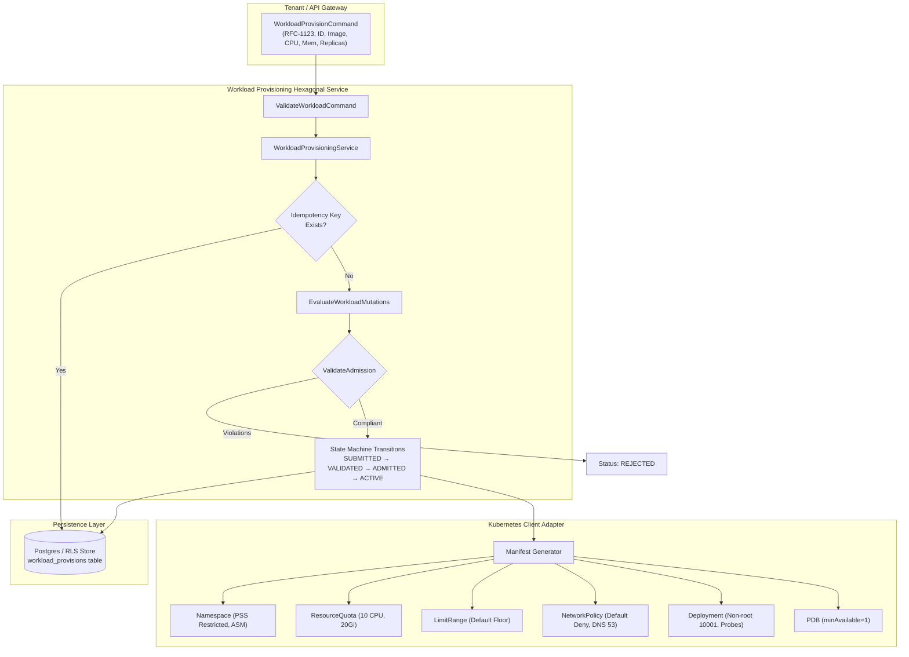

# Architecture & Topology Diagrams: Kubernetes Workload Provisioning

```mermaid
flowchart TD
    subgraph Client["Tenant / API Gateway"]
        CMD["WorkloadProvisionCommand<br/>(RFC-1123, ID, Image, CPU, Mem, Replicas)"]
    end

    subgraph ServiceLayer["Workload Provisioning Hexagonal Service"]
        SVC["WorkloadProvisioningService"]
        VAL["ValidateWorkloadCommand"]
        IDEMP{"Idempotency Key<br/>Exists?"}
        MUT["EvaluateWorkloadMutations"]
        ADM{"ValidateAdmission"}
        FSM["State Machine Transitions<br/>SUBMITTED → VALIDATED → ADMITTED → ACTIVE"]
    end

    subgraph Storage["Persistence Layer"]
        PG[("Postgres / RLS Store<br/>workload_provisions table")]
    end

    subgraph K8sAdapter["Kubernetes Client Adapter"]
        GEN["Manifest Generator"]
        NS["Namespace (PSS Restricted, ASM)"]
        RQ["ResourceQuota (10 CPU, 20Gi)"]
        LR["LimitRange (Default Floor)"]
        NP["NetworkPolicy (Default Deny, DNS 53)"]
        DEP["Deployment (Non-root 10001, Probes)"]
        PDB["PDB (minAvailable=1)"]
    end

    CMD --> VAL
    VAL --> SVC
    SVC --> IDEMP
    IDEMP -- "Yes" --> PG
    IDEMP -- "No" --> MUT
    MUT --> ADM
    ADM -- "Violations" --> REJ["Status: REJECTED"]
    ADM -- "Compliant" --> FSM
    FSM --> PG
    FSM --> GEN
    GEN --> NS
    GEN --> RQ
    GEN --> LR
    GEN --> NP
    GEN --> DEP
    GEN --> PDB
```
