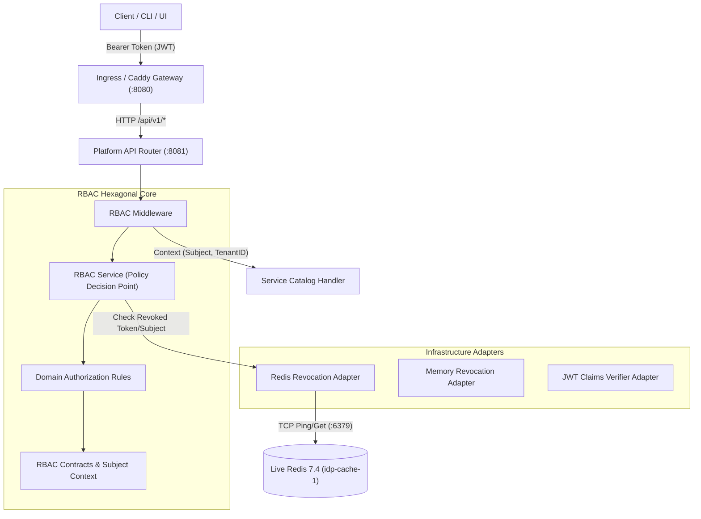
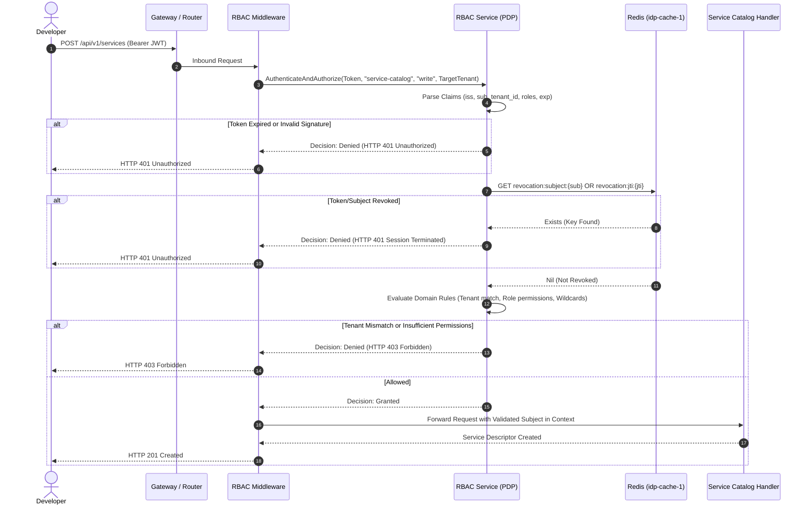

# RBAC & Authorization Architecture Diagrams

## 1. High-Level Architecture (Hexagonal Model)

```mermaid
flowchart TD
    Client["Client / CLI / UI"] -->|"Bearer Token (JWT)"| Ingress["Ingress / Caddy Gateway (:8080)"]
    Ingress -->|"HTTP /api/v1/*"| Router["Platform API Router (:8081)"]
    
    subgraph Core ["RBAC Hexagonal Core"]
        MW["RBAC Middleware"]
        Service["RBAC Service (Policy Decision Point)"]
        Rules["Domain Authorization Rules"]
        Contracts["RBAC Contracts & Subject Context"]
        
        MW --> Service
        Service --> Rules
        Rules --> Contracts
    end

    Router --> MW
    MW -->|"Context (Subject, TenantID)"| CatalogHandler["Service Catalog Handler"]
    
    subgraph SecondaryAdapters ["Infrastructure Adapters"]
        RedisAdapter["Redis Revocation Adapter"]
        MemAdapter["Memory Revocation Adapter"]
        TokenAdapter["JWT Claims Verifier Adapter"]
    end
    
    Service -->|"Check Revoked Token/Subject"| RedisAdapter
    RedisAdapter -->|"TCP Ping/Get (:6379)"| LiveRedis[("Live Redis 7.4 (idp-cache-1)")]
```

## 2. Authorization Flow Sequence

```mermaid
sequenceDiagram
    autonumber
    actor Developer
    participant Ingress as Gateway / Router
    participant MW as RBAC Middleware
    participant Service as RBAC Service (PDP)
    participant Redis as Redis (idp-cache-1)
    participant Catalog as Service Catalog Handler

    Developer->>Ingress: POST /api/v1/services (Bearer JWT)
    Ingress->>MW: Inbound Request
    MW->>Service: AuthenticateAndAuthorize(Token, "service-catalog", "write", TargetTenant)
    
    Service->>Service: Parse Claims (iss, sub, tenant_id, roles, exp)
    alt Token Expired or Invalid Signature
        Service-->>MW: Decision: Denied (HTTP 401 Unauthorized)
        MW-->>Developer: HTTP 401 Unauthorized
    end
    
    Service->>Redis: GET revocation:subject:{sub} OR revocation:jti:{jti}
    alt Token/Subject Revoked
        Redis-->>Service: Exists (Key Found)
        Service-->>MW: Decision: Denied (HTTP 401 Session Terminated)
        MW-->>Developer: HTTP 401 Unauthorized
    end
    Redis-->>Service: Nil (Not Revoked)
    
    Service->>Service: Evaluate Domain Rules (Tenant match, Role permissions, Wildcards)
    alt Tenant Mismatch or Insufficient Permissions
        Service-->>MW: Decision: Denied (HTTP 403 Forbidden)
        MW-->>Developer: HTTP 403 Forbidden
    else Allowed
        Service-->>MW: Decision: Granted
        MW->>Catalog: Forward Request with Validated Subject in Context
        Catalog-->>MW: Service Descriptor Created
        MW-->>Developer: HTTP 201 Created
    end
```
