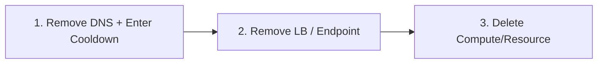

# Diagrams — Self-Service Provisioning

## Provisioning & Compensation Flow

```mermaid
flowchart LR
    API["REST Handler + Idempotency (EC-02)"] --> APP["Approval & Plan Pin (INV-09/10)"]
    APP --> RES["Atomic Reservation (INV-04/05/15, EC-03)"]
    RES --> INT["Intent Row + Fenced Attempt (INV-01/03)"]
    INT --> GIT["Secret Scan + GitOps Commit (INV-08/13)"]
    GIT --> ARGO["Argo CD Sync + Observed Ready (INV-12)"]
    ARGO -->|Fail| COMP["Data-Safe Compensation (INV-06) + Teardown DAG (INV-07)"]
    COMP -->|Protected/Fail| DIRTY["ORPHANED_DIRTY (EC-07)"]
```

## Teardown DAG Order (INV-07)

```mermaid
flowchart LR
    DNS["1. Remove DNS + Enter Cooldown"] --> LB["2. Remove LB / Endpoint"] --> RES["3. Delete Compute/Resource"]
```
